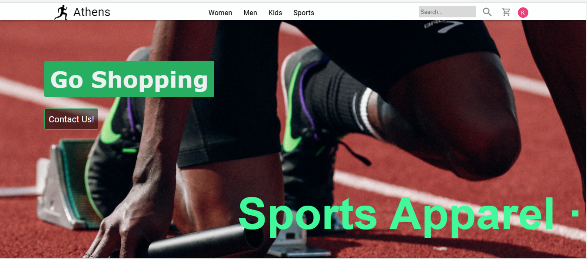
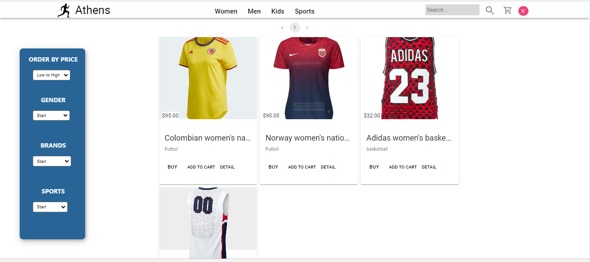
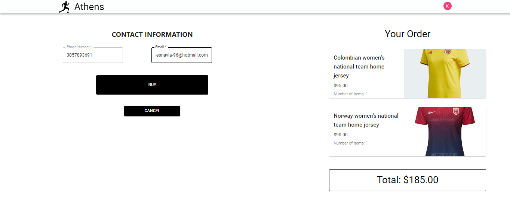

<!-- PROJECT LOGO -->
 

  
  
  <h3 align="center">Athens</h3>

  

    E-Commerce
     
    <a href="https://athens-theta.vercel.app/">Ver Demo</a>
  

<!-- ABOUT THE PROJECT -->
## Sobre el Proyecto
 

Bienvenido a Athens un ecommerce dedicado netamente a la venta de productos deportivo de diferentes deportes 🤗.

Este proyecto nace de la necesidad de encontrar un buen lugar donde comprar las cosas que necesitamos para practicar diferentes deportes y tiene como objetivo tener una manera facil de brindar los productos que ofrecemos.

### Diseño UX/UI

El proyecto lo realizamos y lo logramos con la ausencia de un perfil UX/UI porque la mayoria nos desempeñamos bien como backend o frontend, pero aún asi se logró un buen trabajo gracias al excelente equipo que tenemos, aquí una muestra del diseño inicial que teniamos y que se fue puliendo en cada modificación 👌 [Figma](https://www.figma.com/file/yakoREjsnKFagDZSgrSKeV/Manuel-Benitez's-team-library?node-id=412%3A43)

### Frontend

Con respecta al frontend el team encargado de ese trabajo es excelente una pasada formar parte de ese grupo, el proyecto en frontend lo tratamos de realizar siguiendo un estilo creado en el deiseño UX/UI.Realizamos para cada interfaz un componente y tratamos de desacoplar algunos componentes haciendo micro componentes reutilizables para ahorrar código y tiempo. 

Aqui algunas de las interfaces que realizamos con el equipo de frontend.

  
  
  
